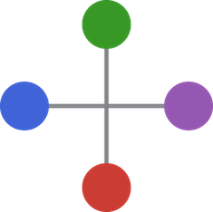
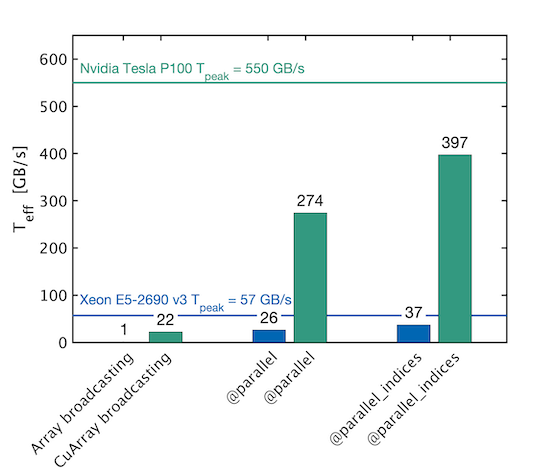
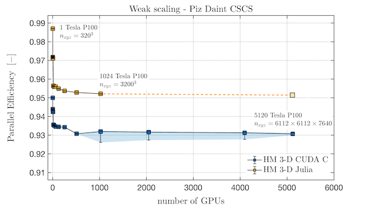
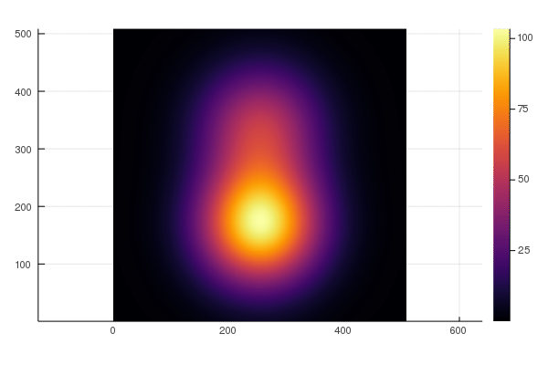
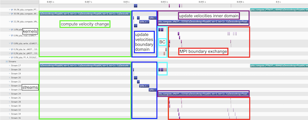

<h1>  ParallelStencil.jl </h1>

[](https://github.com/omlins/ParallelStencil.jl/actions)
[](https://doi.org/10.21105/jcon.00138)

ParallelStencil empowers domain scientists to write architecture-agnostic high-level code for parallel high-performance stencil computations on GPUs and CPUs. Performance similar to CUDA C / HIP can be achieved, which is typically a large improvement over the performance reached when using only [CUDA.jl] or [AMDGPU.jl] [GPU Array programming]. For example, a 2-D shallow ice solver presented at JuliaCon 2020 \[[1][JuliaCon20a]\] achieved a nearly 20 times better performance than a corresponding [GPU Array programming] implementation; in absolute terms, it reached 70% of the theoretical upper performance bound of the used Nvidia P100 GPU, as defined by the effective throughput metric, `T_eff` (note that `T_eff` is very different from common throughput metrics, see section [Performance metric](#performance-metric)). The GPU performance of the solver is reported in green, the CPU performance in blue:

<a id="fig_teff"></a>

ParallelStencil relies on the native kernel programming capabilities of [CUDA.jl], [AMDGPU.jl], [Metal.jl], the multi-architecture [KernelAbstractions.jl] package (enabling the runtime hardware selection workflow described in [Interactive prototyping with runtime hardware selection](#interactive-prototyping-with-runtime-hardware-selection)), and on [Polyester.jl] and [Base.Threads] for high-performance computations on GPUs and CPUs, respectively. It is seamlessly interoperable with [ImplicitGlobalGrid.jl], which renders the distributed parallelization of stencil-based GPU and CPU applications on a regular staggered grid almost trivial and enables close to ideal weak scaling of real-world applications on thousands of GPUs \[[1][JuliaCon20a], [2][JuliaCon20b], [3][JuliaCon19], [4][PASC19]\]. Moreover, ParallelStencil enables hiding communication behind computation with a simple macro call and without any particular restrictions on the package used for communication. ParallelStencil has been designed in conjunction with [ImplicitGlobalGrid.jl] for simplest possible usage by domain-scientists, rendering fast and interactive development of massively scalable high performance multi-GPU applications readily accessible to them. Furthermore, we have developed a self-contained approach for "Solving Nonlinear Multi-Physics on GPU Supercomputers with Julia" relying on ParallelStencil and [ImplicitGlobalGrid.jl] \[[1][JuliaCon20a]\]. ParallelStencil's feature to hide communication behind computation was showcased when a close to ideal weak scaling was demonstrated for a 3-D poro-hydro-mechanical real-world application on up to 1024 GPUs on the Piz Daint Supercomputer \[[1][JuliaCon20a]\]:



A particularity of ParallelStencil is that it enables writing a single high-level Julia code that can be deployed both on a CPU or a GPU. In conjuction with [ImplicitGlobalGrid.jl] the same Julia code can even run on a single CPU thread or on thousands of GPUs/CPUs.

Beyond traditional high-performance computing, ParallelStencil supports automatic differentiation of architecture-agnostic parallel kernels relying on [Enzyme.jl], enabling both high-level and generic syntax for maximal flexibility.

## Contents <!-- omit in toc -->
- [Parallelization and optimization with one macro call](#parallelization-and-optimization-with-one-macro-call)
- [Stencil computations with math-close notation](#stencil-computations-with-math-close-notation)
- [50-lines example deployable on GPU and CPU](#50-lines-example-deployable-on-gpu-and-cpu)
- [50-lines multi-xPU example](#50-lines-multi-xpu-example)
- [Interactive prototyping with runtime hardware selection](#interactive-prototyping-with-runtime-hardware-selection)
- [Seamless interoperability with communication packages and hiding communication](#seamless-interoperability-with-communication-packages-and-hiding-communication)
- [Support for architecture-agnostic low level kernel programming](#support-for-architecture-agnostic-low-level-kernel-programming)
- [Support for logical arrays of small arrays / structs](#support-for-logical-arrays-of-small-arrays--structs)
- [Support for automatic differentiation of architecture-agnostic parallel kernels](#support-for-automatic-differentiation-of-architecture-agnostic-parallel-kernels)
- [Module documentation callable from the Julia REPL / IJulia](#module-documentation-callable-from-the-julia-repl--ijulia)
- [Concise single/multi-xPU miniapps](#concise-singlemulti-xpu-miniapps)
    - [Performance metric](#performance-metric)
    - [Miniapp content](#miniapp-content)
    - [Thermo-mechanical convection 2-D app](#thermo-mechanical-convection-2-d-app)
    - [Viscous Stokes 2-D app](#viscous-stokes-2-d-app)
    - [Viscous Stokes 3-D app](#viscous-stokes-3-d-app)
    - [Acoustic wave 2-D app](#acoustic-wave-2-d-app)
    - [Acoustic wave 3-D app](#acoustic-wave-3-d-app)
    - [Scalar porosity waves 2-D app](#scalar-porosity-waves-2-d-app)
    - [Hydro-mechanical porosity waves 2-D app](#hydro-mechanical-porosity-waves-2-d-app)
- [Dependencies](#dependencies)
- [Installation](#installation)
- [Questions, comments and discussions](#questions-comments-and-discussions)
- [Your contributions](#your-contributions)
- [References](#references)

## Parallelization and optimization with one macro call
A simple call to `@parallel` is enough to parallelize and optimize a function and to launch it. The package used underneath for parallelization is defined in a call to `@init_parallel_stencil` beforehand. Supported are [CUDA.jl], [AMDGPU.jl], [Metal.jl], and the multi-architecture [KernelAbstractions.jl] backend for running on GPU, and [Base.Threads] and [Polyester.jl] for executing on CPU; when using KernelAbstractions the session starts on the CPU and you can switch the hardware target mid-run via `select_hardware`/`current_hardware` as outlined in [Interactive prototyping with runtime hardware selection](#interactive-prototyping-with-runtime-hardware-selection). The following example outlines how to run parallel computations on a GPU using the native kernel programming capabilities of [CUDA.jl] underneath (omitted lines are represented with `#(...)`, omitted arguments with `...`):
```julia
#(...)
@init_parallel_stencil(CUDA,...)
#(...)
@parallel function diffusion3D_step!(...)
    #(...)
end
#(...)
@parallel diffusion3D_step!(...)
```
Automatic advanced fast memory usage optimization (of shared memory and registers) can be activated with the keyword argument `memopt=true`:
```julia
@parallel memopt=true function diffusion3D_step!(...)
    #(...)
end
#(...)
@parallel memopt=true diffusion3D_step!(...)
```
Note that arrays are automatically allocated on the hardware chosen for the computations (GPU or CPU) when using the provided allocation macros:
- `@zeros`
- `@ones`
- `@rand`
- `@falses`
- `@trues`
- `@fill`

## Stencil computations with math-close notation
ParallelStencil provides submodules for computing finite differences in 1-D, 2-D and 3-D with a math-close notation (`FiniteDifferences1D`, `FiniteDifferences2D` and `FiniteDifferences3D`). Custom macros to extend the finite differences submodules or for other stencil-based numerical methods can be readily plugged in. The following example shows a complete function for computing a time step of a 3-D heat diffusion solver using `FiniteDifferences3D`.
```julia
#(...)
using ParallelStencil.FiniteDifferences3D
#(...)
@parallel function diffusion3D_step!(T2, T, Ci, lam, dt, dx, dy, dz)
    @inn(T2) = @inn(T) + dt*(lam*@inn(Ci)*(@d2_xi(T)/dx^2 + @d2_yi(T)/dy^2 + @d2_zi(T)/dz^2));
    return
end
```
The macros used in this example are described in the [Module documentation callable from the Julia REPL / IJulia](#module-documentation-callable-from-the-julia-repl--ijulia):
```julia-repl
julia> using ParallelStencil.FiniteDifferences3D
julia>?
help?> @inn
  @inn(A): Select the inner elements of A. Corresponds to A[2:end-1,2:end-1,2:end-1].

help?> @d2_xi
  @d2_xi(A): Compute the 2nd order differences between adjacent elements of A along the along dimension x and select the inner elements of A in the remaining dimensions. Corresponds to @inn_yz(@d2_xa(A)).
```
Note that`@d2_yi` and `@d2_zi` perform the analogue operations as `@d2_xi` along the dimension y and z, respectively.

Type `?FiniteDifferences3D` in the [Julia REPL] to explore all provided macros.

## 50-lines example deployable on GPU and CPU
This concise 3-D heat diffusion solver uses ParallelStencil and a simple boolean `USE_GPU` defines whether it runs on GPU or CPU (the environment variable [JULIA_NUM_THREADS] defines how many cores are used in the latter case):

```julia
const USE_GPU = true
using ParallelStencil
using ParallelStencil.FiniteDifferences3D
@static if USE_GPU
    @init_parallel_stencil(CUDA, Float64, 3);
else
    @init_parallel_stencil(Threads, Float64, 3);
end

@parallel function diffusion3D_step!(T2, T, Ci, lam, dt, dx, dy, dz)
    @inn(T2) = @inn(T) + dt*(lam*@inn(Ci)*(@d2_xi(T)/dx^2 + @d2_yi(T)/dy^2 + @d2_zi(T)/dz^2));
    return
end

function diffusion3D()
# Physics
lam        = 1.0;                                        # Thermal conductivity
cp_min     = 1.0;                                        # Minimal heat capacity
lx, ly, lz = 10.0, 10.0, 10.0;                           # Length of domain in dimensions x, y and z.

# Numerics
nx, ny, nz = 256, 256, 256;                              # Number of gridpoints dimensions x, y and z.
nt         = 100;                                        # Number of time steps
dx         = lx/(nx-1);                                  # Space step in x-dimension
dy         = ly/(ny-1);                                  # Space step in y-dimension
dz         = lz/(nz-1);                                  # Space step in z-dimension

# Array initializations
T   = @zeros(nx, ny, nz);
T2  = @zeros(nx, ny, nz);
Ci  = @zeros(nx, ny, nz);

# Initial conditions (heat capacity and temperature with two Gaussian anomalies each)
Ci .= 1.0./( cp_min .+ Data.Array([5*exp(-(((ix-1)*dx-lx/1.5))^2-(((iy-1)*dy-ly/2))^2-(((iz-1)*dz-lz/1.5))^2) +
                                   5*exp(-(((ix-1)*dx-lx/3.0))^2-(((iy-1)*dy-ly/2))^2-(((iz-1)*dz-lz/1.5))^2) for ix=1:size(T,1), iy=1:size(T,2), iz=1:size(T,3)]) )
T  .= Data.Array([100*exp(-(((ix-1)*dx-lx/2)/2)^2-(((iy-1)*dy-ly/2)/2)^2-(((iz-1)*dz-lz/3.0)/2)^2) +
                   50*exp(-(((ix-1)*dx-lx/2)/2)^2-(((iy-1)*dy-ly/2)/2)^2-(((iz-1)*dz-lz/1.5)/2)^2) for ix=1:size(T,1), iy=1:size(T,2), iz=1:size(T,3)])
T2 .= T;                                                 # Assign also T2 to get correct boundary conditions.

# Time loop
dt = min(dx^2,dy^2,dz^2)*cp_min/lam/8.1;                 # Time step for the 3D Heat diffusion
for it = 1:nt
    @parallel diffusion3D_step!(T2, T, Ci, lam, dt, dx, dy, dz);
    T, T2 = T2, T;
end

end

diffusion3D()
```

The corresponding file can be found [here](/examples/diffusion3D_novis_noperf.jl).

## 50-lines multi-xPU example
This concise multi-xPU 3-D heat diffusion solver uses ParallelStencil in conjunction with [ImplicitGlobalGrid.jl] and can be readily deployed on on a single CPU thread or on thousands of GPUs/CPUs. Again, a simple boolean `USE_GPU` defines whether it runs on GPU(s) or CPU(s) ([JULIA_NUM_THREADS] defines how many cores are used in the latter case). The solver can be run with any number of processes. [ImplicitGlobalGrid.jl] creates automatically an implicit global computational grid based on the number of processes the solver is run with (and based on the process topology, which can be explicitly chosen by the user or automatically determined). Please refer to the documentation of [ImplicitGlobalGrid.jl] for more information.

```julia
const USE_GPU = true
using ImplicitGlobalGrid
import MPI
using ParallelStencil
using ParallelStencil.FiniteDifferences3D
@static if USE_GPU
    @init_parallel_stencil(CUDA, Float64, 3);
else
    @init_parallel_stencil(Threads, Float64, 3);
end

@parallel function diffusion3D_step!(T2, T, Ci, lam, dt, dx, dy, dz)
    @inn(T2) = @inn(T) + dt*(lam*@inn(Ci)*(@d2_xi(T)/dx^2 + @d2_yi(T)/dy^2 + @d2_zi(T)/dz^2));
    return
end

function diffusion3D()
# Physics
lam        = 1.0;                                        # Thermal conductivity
cp_min     = 1.0;                                        # Minimal heat capacity
lx, ly, lz = 10.0, 10.0, 10.0;                           # Length of domain in dimensions x, y and z.

# Numerics
nx, ny, nz = 256, 256, 256;                              # Number of gridpoints dimensions x, y and z.
nt         = 100;                                        # Number of time steps
init_global_grid(nx, ny, nz);
dx         = lx/(nx_g()-1);                              # Space step in x-dimension
dy         = ly/(ny_g()-1);                              # Space step in y-dimension
dz         = lz/(nz_g()-1);                              # Space step in z-dimension

# Array initializations
T   = @zeros(nx, ny, nz);
T2  = @zeros(nx, ny, nz);
Ci  = @zeros(nx, ny, nz);

# Initial conditions (heat capacity and temperature with two Gaussian anomalies each)
Ci .= 1.0./( cp_min .+ Data.Array([5*exp(-((x_g(ix,dx,Ci)-lx/1.5))^2-((y_g(iy,dy,Ci)-ly/2))^2-((z_g(iz,dz,Ci)-lz/1.5))^2) +
                                   5*exp(-((x_g(ix,dx,Ci)-lx/3.0))^2-((y_g(iy,dy,Ci)-ly/2))^2-((z_g(iz,dz,Ci)-lz/1.5))^2) for ix=1:size(T,1), iy=1:size(T,2), iz=1:size(T,3)]) )
T  .= Data.Array([100*exp(-((x_g(ix,dx,T)-lx/2)/2)^2-((y_g(iy,dy,T)-ly/2)/2)^2-((z_g(iz,dz,T)-lz/3.0)/2)^2) +
                   50*exp(-((x_g(ix,dx,T)-lx/2)/2)^2-((y_g(iy,dy,T)-ly/2)/2)^2-((z_g(iz,dz,T)-lz/1.5)/2)^2) for ix=1:size(T,1), iy=1:size(T,2), iz=1:size(T,3)])
T2 .= T;                                                 # Assign also T2 to get correct boundary conditions.

# Time loop
dt = min(dx^2,dy^2,dz^2)*cp_min/lam/8.1;                 # Time step for the 3D Heat diffusion
for it = 1:nt
    @parallel diffusion3D_step!(T2, T, Ci, lam, dt, dx, dy, dz);
    update_halo!(T2);
    T, T2 = T2, T;
end

finalize_global_grid();
end

diffusion3D()
```
The corresponding file can be found [here](/examples/diffusion3D_multigpucpu_novis_noperf.jl).

Thanks to [ImplicitGlobalGrid.jl], only a few function calls had to be added in order to turn the previous single GPU/CPU solver into a multi-xPU solver (omitted unmodified lines are represented with `#(...)`):
```julia
#(...)
using ImplicitGlobalGrid
#(...)
function diffusion3D()
# Physics
#(...)
# Numerics
#(...)
init_global_grid(nx, ny, nz);
dx  = lx/(nx_g()-1);                                     # Space step in x-dimension
dy  = ly/(ny_g()-1);                                     # Space step in y-dimension
dz  = lz/(nz_g()-1);                                     # Space step in z-dimension

# Array initializations
#(...)

# Initial conditions (heat capacity and temperature with two Gaussian anomalies each)
Ci .= 1.0./( cp_min .+ Data.Array([5*exp(-((x_g(ix,dx,Ci)-lx/1.5))^2-((y_g(iy,dy,Ci)-ly/2))^2-((z_g(iz,dz,Ci)-lz/1.5))^2) +
                                   5*exp(-((x_g(ix,dx,Ci)-lx/3.0))^2-((y_g(iy,dy,Ci)-ly/2))^2-((z_g(iz,dz,Ci)-lz/1.5))^2) for ix=1:size(T,1), iy=1:size(T,2), iz=1:size(T,3)]) )
T  .= Data.Array([100*exp(-((x_g(ix,dx,T)-lx/2)/2)^2-((y_g(iy,dy,T)-ly/2)/2)^2-((z_g(iz,dz,T)-lz/3.0)/2)^2) +
                   50*exp(-((x_g(ix,dx,T)-lx/2)/2)^2-((y_g(iy,dy,T)-ly/2)/2)^2-((z_g(iz,dz,T)-lz/1.5)/2)^2) for ix=1:size(T,1), iy=1:size(T,2), iz=1:size(T,3)])

# Time loop
#(...)
for it = 1:nt
    #(...)
    update_halo!(T2);
    #(...)
end

finalize_global_grid();
end

diffusion3D()
```

Here is the resulting movie when running the application on 8 GPUs, solving 3-D heat diffusion with heterogeneous heat capacity (two Gaussian anomalies) on a global computational grid of size 510x510x510 grid points. It shows the x-z-dimension plane in the middle of the dimension y:



The corresponding file can be found [here](/examples/diffusion3D_multigpucpu_hidecomm.jl).

## Interactive prototyping with runtime hardware selection
The KernelAbstractions backend keeps the familiar parse-time `@init_parallel_stencil` workflow while enabling runtime hardware switches through the `select_hardware` and `current_hardware` functions; the runtime hardware target defaults to CPU and can be switched as many times as desired during a session without requiring redefinition of kernels or reinitialization of the backend. The following copy-pasteable example outlines this workflow with a simple SAXPY kernel, demonstrating initial execution on CPU followed by a switch to CUDA-capable GPU and a second execution there:

```julia
# --- Session setup -----------------------------------------------------
using ParallelStencil
@init_parallel_stencil(package=KernelAbstractions, numbertype=Float32)  # 1 Initialize KernelAbstractions backend at parse time
const N = 1024
const α = 2.5

# --- Kernel definition -------------------------------------------------
@parallel_indices (i) function saxpy!(Y, α, X)                          # 2 Define a single time a hardware-agnostic SAXPY kernel
  Y[i] = α * X[i] + Y[i]
  return
end

# --- First run on default runtime hardware (CPU) -----------------------
println("Current runtime hardware target: ", current_hardware())        # 3 Query current (default) runtime hardware target
X = @rand(N)                                                            # 4 Allocate data on the current target
Y = @rand(N)                                                            # 4 Allocate data on the current target
@parallel saxpy!(Y, α, X)                                               # 5 Launch kernel on the current target

# --- Reselect runtime hardware to CUDA-capable GPU and run again -------
select_hardware(:gpu_cuda)                                              # 6 Switch runtime hardware target to CUDA-capable GPU
println("Current runtime hardware target: ", current_hardware())        # 7 Confirm the CUDA-capable GPU runtime hardware target
X = @rand(N)                                                            # 8 Allocate data on the new target
Y = @rand(N)                                                            # 8 Allocate data on the new target
@parallel saxpy!(Y, α, X)                                               # 9 Launch kernel on the new target without redefining anything
```
Type `?select_hardware` and `?current_hardware` in the [Julia REPL] to see what runtime hardware targets are supported and which symbols to use to select them.
Note that the KernelAbstractions backend comes with a trade-off: the convenience `Data`/`TData` modules for fixed data types and single-architecture backends are not available, as well as the warp-level primitives in `@parallel_indices` kernels (see [Support for architecture-agnostic low level kernel programming](#support-for-architecture-agnostic-low-level-kernel-programming)).

## Seamless interoperability with communication packages and hiding communication
The previous multi-xPU example shows that ParallelStencil is seamlessly interoperable with [ImplicitGlobalGrid.jl]. The same is a priori true for any communication package that allows to explicitly decide when the required communication occurs; an example is [MPI.jl] (besides, [MPI.jl] is also seamlessly interoperable with [ImplicitGlobalGrid.jl] and can extend its functionality).

Moreover, ParallelStencil enables hiding communication behind computation with as simple call to `@hide_communication`. In the following example, the communication performed by `update_halo!` (from the package [ImplicitGlobalGrid.jl]) is hidden behind the computations done with by `@parallel diffusion3D_step!`:
```julia
@hide_communication (16, 2, 2) begin
    @parallel diffusion3D_step!(T2, Te Ci, lam, dt, dx, dy, dz);
    update_halo!(T2);
end
```
This enables close to ideal weak scaling of real-world applications on thousands of GPUs/CPUs \[[1][JuliaCon20a], [2][JuliaCon20b]\]. Type `?@hide_communication` in the [Julia REPL] to obtain an explanation of the arguments. Profiling a 3-D viscous Stokes flow application using the Nvidia visual profiler (nvvp) graphically exemplifies how the update velocities kernel is split up in boundary and inner domain computations and how the latter overlap with point-to-point MPI communication for halo exchange:



## Support for architecture-agnostic low level kernel programming
High-level [stencil computations with math-close notation](#stencil-computations-with-math-close-notation) can be completed with index-based programming using the macro `@parallel_indices`. For example, the following kernel enables setting Neumann boundary conditions in dimension y (`∂A/∂y = 0`) when using finite differences in 3-D:
```julia
@parallel_indices (ix,iz) function bc_y!(A)
    A[ix,   1, iz] = A[ix,     2, iz]
    A[ix, end, iz] = A[ix, end-1, iz]
    return
end
```
It can be launched as follows:
```julia
@parallel (1:size(A,1), 1:size(A,3)) bc_y!(A)
```
Furthermore, a set of architecture-agnostic low level kernel language constructs is supported in these `@parallel_indices` kernels (see in [Module documentation callable from the Julia REPL / IJulia](#module-documentation-callable-from-the-julia-repl--ijulia)). They enable, e.g., explicit usage of shared memory (see [this 2-D heat diffusion example](/examples/diffusion2D_shmem_novis.jl)) and usage of warp-level primitives.

## Support for logical arrays of small arrays / structs
Logical arrays of small arrays / structs enabling optimized data access can be conveniently created with the architecture-agnostic allocation macros earlier introduced (see [Parallelization and optimization with one macro call](#parallelization-with-one-macro-call)). To this purpose, ParallelStencil leverages `CellArray`s (from [CellArrays.jl], which relies in turn on [StaticArrays.jl]). To create a logical array of small arrays, it is sufficient to pass to any of these allocation macros the keyword `celldims` with the dimensions of the inner arrays, e.g.:
```julia
nx, ny, nz = 128, 128, 128
celldims   = (4, 4)
A = @rand(nx, ny, nz, celldims=celldims)
```
To create a logical array of structs, a custom cell type can be defined using the macro `@CellType` and then passed to any of the allocation macros via the keyword `celltype`, e.g.:
```julia
@CellType SymmetricTensor3D fieldnames=(xx, yy, zz, yz, xz, xy)
#(...)
A = @zeros(nx, ny, nz, celltype=SymmetricTensor3D)
```
Details are found in the [Module documentation callable from the Julia REPL / IJulia](#module-documentation-callable-from-the-julia-repl--ijulia).

## Support for automatic differentiation of architecture-agnostic parallel kernels
[Enzyme.jl]-powered automatic differentiation of architecture-agnostic parallel kernels is fully integrated into ParallelStencil's API and exposed both with high-level and generic syntax. The keyword argument `∇` is enough to trigger a parallel call to the gradient kernel instead of the kernel itself, e.g:
```julia
#(...)
@parallel_indices (ix) function f!(A, B, a)
    A[ix] += a * B[ix] * 100.65
    return
end

N = 16
a = 6.5
A = @rand(N)
B = @rand(N)
Ā = @ones(N)
B̄ = @ones(N)

@parallel f!(A, B, a)                 # normal call of f!
@parallel ∇=(A->Ā, B->B̄) f!(A, B, a)  # call to the gradient of f!, differentiated with respect to A and B
```
Keyword arguments to `@parallel` allow to customize the automatic differentiation (type `?@parallel` to read the corresponding documentation). Automatic differentiation is supported for both `@parallel` and `@parallel_indices` kernels.

The generic syntax, which is enabled by the submodule `ParallelStencil.AD`, provides maximal flexibility. For the above example it looks as follows:
```julia
import ParallelStencil.AD
using Enzyme
#(...)
@parallel f!(A, B, a)                                                                                                                 # normal call of f!
@parallel configcall=f!(A, B, a) AD.autodiff_deferred!(Enzyme.Reverse, f!, DuplicatedNoNeed(A, Ā), DuplicatedNoNeed(B, B̄), Const(a))  # call to the gradient of f!, differentiated with respect to A and B
```
The submodule `ParallelStencil.AD` contains GPU-compatible wrappers of Enzyme functions (returning always `nothing` as required by the backend packages [CUDA.jl] and [AMDGPU.jl]); the wrapper `AD.autodiff_deferred!` maps, e.g., `Enzyme.autodiff_deferred`. The keyword argument `configcall` makes it trivial to call these generic functions for automatic differentiation with the right launch parameters.

## Module documentation callable from the Julia REPL / IJulia
The module documentation can be called from the [Julia REPL] or in [IJulia]:
```julia-repl
julia> using ParallelStencil
julia>?
help?> ParallelStencil
search: ParallelStencil @init_parallel_stencil

  Module ParallelStencil

  Enables domain scientists to write high-level code for parallel high-performance stencil computations that can be deployed on both GPUs and CPUs.

  General overview and examples
  ≡≡≡≡≡≡≡≡≡≡≡≡≡≡≡≡≡≡≡≡≡≡≡≡≡≡≡≡≡≡≡

  https://github.com/omlins/ParallelStencil.jl

  Primary macros
  ≡≡≡≡≡≡≡≡≡≡≡≡≡≡≡≡

    •  @init_parallel_stencil

    •  @parallel

    •  @hide_communication

    •  @zeros

    •  @ones

    •  @rand

    •  @falses

    •  @trues

    •  @fill

  │ Advanced
  │
  │    •  @parallel_indices
  │
  │    •  @parallel_async
  │
  │    •  @synchronize

  Macros available for @parallel_indices kernels
  ≡≡≡≡≡≡≡≡≡≡≡≡≡≡≡≡≡≡≡≡≡≡≡≡≡≡≡≡≡≡≡≡≡≡≡≡≡≡≡≡≡≡≡≡≡≡≡≡

    •  @ps_show

    •  @ps_println

  │ Advanced
  │
  │    •  @gridDim
  │
  │    •  @blockIdx
  │
  │    •  @blockDim
  │
  │    •  @threadIdx
  │
  │    •  @sync_threads
  │
  │    •  @sharedMem

  Submodules
  ≡≡≡≡≡≡≡≡≡≡≡≡

    •  ParallelStencil.FiniteDifferences1D

    •  ParallelStencil.FiniteDifferences2D

    •  ParallelStencil.FiniteDifferences3D

  Modules generated in caller
  ≡≡≡≡≡≡≡≡≡≡≡≡≡≡≡≡≡≡≡≡≡≡≡≡≡≡≡≡≡

    •  Data

  To see a description of a macro or module type ?<macroname> (including the @) or ?<modulename>, respectively.
```

## Concise single/multi-xPU miniapps
The miniapps regroup a collection of various 2-D and 3-D codes that leverage ParallelStencil to implement architecture-agnostic high-level code for parallel high-performance stencil computations on GPUs and CPUs. The miniapps target various challenging domain science case studies where multi-physics coupling and important nonlinearities challenge existing solving strategies. In most cases, second order pseudo-transient relaxation delivers implicit solutions of the differential equations. Some miniapps feature a multi-xPU version, which combines the capabilities of ParallelStencil and [ImplicitGlobalGrid.jl] in order to enable multi-GPU and multi-CPU executions, unleashing _Julia-at-scale_.

#### Performance metric
Many-core processors as GPUs are throughput-oriented systems that use their massive parallelism to hide latency. On the scientific application side, most algorithms require only a few operations or flops compared to the amount of numbers or bytes accessed from main memory, and thus are significantly memory bound. The Flop/s metric is no longer the most adequate for reporting the application performance of many modern applications. This  status  motivated us to develop a memory throughput-based performance evaluation metric, `T_eff`, to evaluate the performance of iterative stencil-based solvers \[[1][JuliaCon20a]\].

The effective memory access, `A_eff` [GB], is the the sum of twice the memory footprint of the unknown fields, `D_u`, (fields that depend on their own history and that need to be updated every iteration) and the known fields, `D_k`, that do not change every iteration. The effective memory access divided by the execution time per iteration, `t_it` [sec], defines the effective memory throughput, `T_eff` [GB/s].


The upper bound of `T_eff` is `T_peak` as measured e.g. by the \[[7][STREAM benchmark]\] for CPUs or a GPU analogue. Defining the `T_eff` metric, we assume that 1) we evaluate an iterative stencil-based solver, 2) the problem size is much larger than the cache sizes and 3) the usage of time blocking is not feasible or advantageous (which is a reasonable assumption for real-world applications). An important concept is not to include fields within the effective memory access that do not depend on their own history (e.g. fluxes); such fields can be re-computed on the fly or stored on-chip. Defining a theoretical upper bound for `T_eff` that is closer to the real upper bound is work in progress.

Using simple array broadcasting capabilities both with GPU and CPU arrays within Julia does not enable close to optimal performance; ParallelStencil.jl permits to overcome this limitation (see <a href="#fig_teff">top figure</a>) at similar ease of programming.

#### Miniapp content
* [Thermo-mechanical convection 2-D app](#thermo-mechanical-convection-2-d-app)
* [Viscous Stokes 2-D app](#viscous-stokes-2-d-app)
* [Viscous Stokes 3-D app](#viscous-stokes-3-d-app)
* [Acoustic wave 2-D app](#acoustic-wave-2-d-app)
* [Acoustic wave 3-D app](#acoustic-wave-3-d-app)
* [Scalar porosity waves 2-D app](#scalar-porosity-waves-2-d-app)
* [Hydro-mechanical porosity waves 2-D app](#hydro-mechanical-porosity-waves-2-d-app)
* More to come, stay tuned...

All miniapp codes follow a similar structure and permit serial and threaded CPU as well as Nvidia GPU execution. The first line of each miniapp code permits to enable the CUDA.jl GPU backend upon setting the `USE_GPU` flag to `true`.

All the miniapps can be interactively executed within the [Julia REPL] (this includes the multi-xPU versions when using a single CPU or GPU). Note that for optimal performance the miniapp script of interest `<miniapp_code>` should be launched from the shell using the project's dependencies `--project`, disabling array bound checking `--check-bounds=no`, and using optimization level 3 `-O3`.
```sh
$ julia --project --check-bounds=no -O3 <miniapp_code>.jl
```

Note: refer to the documentation of your Supercomputing Centre for instructions to run Julia at scale. Instructions for running on the Piz Daint GPU supercomputer at the [Swiss National Supercomputing Centre](https://www.cscs.ch/computers/piz-daint/) can be found [here](https://user.cscs.ch/tools/interactive/julia/) and for running on the octopus GPU supercomputer at the [Swiss Geocomputing Centre](https://wp.unil.ch/geocomputing/octopus/) can be found [here](https://gist.github.com/luraess/45a7a4059d8ace694812e7e301f1a258).

#### Thermo-mechanical convection 2-D app
> app: [ThermalConvection2D.jl](/miniapps/ThermalConvection2D.jl)

This thermal convection example in 2-D combines a viscous Stokes flow to advection-diffusion of heat including a temperature-dependent shear viscosity. The miniapp resolves thermal convection cells (e.g. Earth's mantle convection and plumes):


*The gif depicts non-dimensional temperature field as evolving into convection cells and plumes*. Results are obtained by running the miniapp [ThermalConvection2D.jl](/miniapps/ThermalConvection2D.jl).

#### Viscous Stokes 2-D app
> app: [Stokes2D.jl](/miniapps/Stokes2D.jl)

The viscous Stokes flow example solves the incompressible Stokes equations with linear shear rheology in 2-D. The model configuration represents a buoyant inclusion within a less buoyant matrix:


*The figure depicts - Upper panels: the dynamical pressure field, the vertical Vy velocity. Lower pannels: the log10 of the vertical momentum balance residual Ry and the log10 of the error norm evolution as function of pseudo-transient iterations*. Results are obtained by running the miniapp [Stokes2D.jl](/miniapps/Stokes2D.jl).

#### Viscous Stokes 3-D app
> apps: [Stokes3D.jl](/miniapps/Stokes3D.jl), [Stokes3D_multixpu.jl](/miniapps/stokes_multixpu/Stokes3D_multixpu.jl)

The viscous Stokes flow example solves the incompressible Stokes equations with linear shear rheology in 3-D. The model configuration represents a buoyant spherical inclusion within a less buoyant matrix:


_The figure depicts vertically sliced cross-sections of - Upper panels: the dynamical pressure field, the vertical Vz velocity. Lower panels: the log10 of the vertical momentum balance residual Rz and the log10 of the error norm evolution as function of pseudo-transient iterations. **The numerical resolution is 252x252x252 grid points in 3-D on 8 GPUs (i.e. a local domain size of 127x127x127 per GPU).**_ The [Stokes3D.jl](/miniapps/Stokes3D.jl) and [Stokes3D_multixpu.jl](/miniapps/stokes_multixpu/Stokes3D_multixpu.jl) are single- and multi-xPU implementations, respectively. The multi-xPU implementation demonstrates ParallelStencil's capabilities to hide computations behind communication, which is performed with [ImplicitGlobalGrid.jl] in this case. Results are obtained by running the multi-xPU miniapp [Stokes3D_multixpu.jl](/miniapps/stokes_multixpu/Stokes3D_multixpu.jl) on 8 Nvidia Titan Xm GPUs distributed across two physically distinct compute nodes.

This multi-xPU application permits to leverage distributed memory parallelisation to enable large-scale 3-D calculations.

#### Acoustic wave 2-D app
> app: [acoustic2D.jl](/miniapps/acoustic2D.jl)

The acoustic wave example solves acoustic waves in 2-D using the split velocity-pressure formulation:


*The animation depicts the dynamical pressure field evolution as function of explicit time steps*. Results are obtained by running the miniapp [acoustic2D.jl](/miniapps/acoustic2D.jl).

#### Acoustic wave 3-D app
> apps: [acoustic3D.jl](/miniapps/acoustic3D.jl), [acoustic3D_multixpu.jl](/miniapps/acoustic_waves_multixpu/acoustic3D_multixpu.jl)

The acoustic wave examples solves acoustic waves in 3-D using the split velocity-pressure formulation:


_The animation depicts the y-slice of the dynamical pressure field evolution as function of explicit time steps. **The achieved numerical resolution is 1020x1020x1020 grid points in 3-D on 8 GPUs (i.e. a local domain size of 511x511x511 per GPU).**_ The [acoustic3D.jl](/miniapps/acoustic3D.jl) and [acoustic3D_multixpu.jl](/miniapps/acoustic_waves_multixpu/acoustic3D_multixpu.jl) are single- and multi-xPU implementation, respectively. The multi-xPU implementation demonstrates ParallelStencil's capabilities to hide computations behind communication, which is performed with [ImplicitGlobalGrid.jl] in this case. Results are obtained by running the multi-xPU miniapp [acoustic3D_multixpu.jl](/miniapps/acoustic_waves_multixpu/acoustic3D_multixpu.jl) on 8 Nvidia Titan Xm GPUs distributed across two physically distinct compute nodes.

This multi-xPU application permits to leverage distributed memory parallelisation to enable large-scale 3-D calculations.

#### Scalar porosity waves 2-D app
> app: [scalar_porowaves2D.jl](/miniapps/scalar_porowaves2D.jl)

The scalar porosity waves example solves the scalar solitary wave equations in 2-D assuming total pressure to be lithostatic, thus eliminating the need to solve for the total pressure explicitly:


*The animation depicts the normalised porosity and effective pressure fields evolution as function of explicit time steps. Top row: compaction and decompaction rheology are identical, resulting in circular solitary waves rearranging into solitons of characteristic size. Bottom row: decompaction occurs at much faster rate compared to compaction, resulting in chimney-shaped features.*

#### Hydro-mechanical porosity waves 2-D app
> app: [HydroMech2D.jl](/miniapps/HydroMech2D.jl)

The hydro-mechanical porosity wave example resolves solitary waves in 2-D owing to hydro-mechanical coupling, removing the lithostatic pressure assumption. The total and fluid pressure are explicitly computed from nonlinear Stokes and Darcy flow solvers, respectively \[[8][GJI2019]\]:


*The animation depicts the formation of fluid escape pipes in two-phase media, owing to decompaction weakening running the miniapp [HydroMech2D.jl](/miniapps/HydroMech2D.jl). Top row: evolution of the porosity distribution and effective pressure. Bottom row: Darcy flux (relative fluid to solid motion) and solid (porous matrix) deformation.*

## Dependencies
ParallelStencil relies on the Julia packages ([CUDA.jl] \[[5][Julia CUDA paper 1], [6][Julia CUDA paper 2]\]), [AMDGPU.jl], [Metal.jl], [KernelAbstractions.jl], [Polyester.jl], [MacroTools.jl], [CellArrays.jl], [StaticArrays.jl] and [Enzyme.jl]. However, thanks to usage of Julia's extensions feature, only [CellArrays.jl], [MacroTools.jl] and [StaticArrays.jl] are fix dependencies that will be automatically installed when installing ParallelStencil; the other packages are only required when using the respective backends or features.

## Installation
ParallelStencil may be installed directly with the [Julia package manager](https://docs.julialang.org/en/v1/stdlib/Pkg/index.html) from the REPL:
```julia-repl
julia>]
  pkg> add ParallelStencil
  pkg> test ParallelStencil
```

## Questions, comments and discussions
To discuss technical issues, please post on Julia Discourse in the [GPU topic] or the [Julia at Scale topic] or in the `#gpu` or `#hpc` channels on the [Julia Slack] (to join, visit https://julialang.org/slack/).
To discuss numerical/domain-science issues, please post on Julia Discourse in the [Numerics topic] or the [Modelling & Simulations topic] or whichever other topic fits best your issue.

## Your contributions
This project welcomes your contribution! Have you developed an application with ParallelStencil that could be featured as a mini-app? Please contribute it to share it with the world! Would you like to use other methods than finite differences with math-close notation in ParallelStencil kernels? Then check out the tiny `ParallelStencil.FiniteDifferences1D` submodule as an example for enabling math-close notation for a method and contribute your own submodule! Are you missing a great feature in the core of ParallelStencil? Maybe you can contribute yourself!
Please open an issue to discuss your idea for a contribution beforehand. Furthermore, note that a pull request should always address a significant issue in its completeness. Moreover, pull requests should blend nicely into the existing project; common sense is the primary guide in this regard (community guideline documents, e.g. [ColPrac](https://github.com/SciML/ColPrac), can be consulted in addition for inspiration). We are looking forward to your contribution!

## References
\[1\] [Omlin, S., Räss, L., Kwasniewski, G., Malvoisin, B., & Podladchikov, Y. Y. (2020). Solving Nonlinear Multi-Physics on GPU Supercomputers with Julia. JuliaCon Conference, virtual.][JuliaCon20a]

\[2\] [Räss, L., Reuber, G., Omlin, S. (2020). Multi-Physics 3-D Inversion on GPU Supercomputers with Julia. JuliaCon Conference, virtual.][JuliaCon20b]

\[3\] [Räss, L., Omlin, S., & Podladchikov, Y. Y. (2019). Porting a Massively Parallel Multi-GPU Application to Julia: a 3-D Nonlinear Multi-Physics Flow Solver. JuliaCon Conference, Baltimore, USA.][JuliaCon19]

\[4\] [Räss, L., Omlin, S., & Podladchikov, Y. Y. (2019). A Nonlinear Multi-Physics 3-D Solver: From CUDA C + MPI to Julia. PASC19 Conference, Zurich, Switzerland.][PASC19]

\[5\] [Besard, T., Foket, C., & De Sutter, B. (2018). Effective Extensible Programming: Unleashing Julia on GPUs. IEEE Transactions on Parallel and Distributed Systems, 30(4), 827-841. doi: 10.1109/TPDS.2018.2872064][Julia CUDA paper 1]

\[6\] [Besard, T., Churavy, V., Edelman, A., & De Sutter B. (2019). Rapid software prototyping for heterogeneous and distributed platforms. Advances in Engineering Software, 132, 29-46. doi: 10.1016/j.advengsoft.2019.02.002][Julia CUDA paper 2]

\[7\] [McCalpin, J. D. (1995). Memory Bandwidth and Machine Balance in Current High Performance Computers. IEEE Computer Society Technical Committee on Computer Architecture (TCCA) Newsletter, December 1995.][STREAM benchmark]

\[8\] [Räss, L., Duretz, T., & Podladchikov, Y. Y. (2019). Resolving hydromechanical coupling in two and three dimensions: spontaneous channelling of porous fluids owing to de-compaction weakening. Geophysical Journal International, ggz239.][GJI2019]

[JuliaCon20a]: https://www.youtube.com/watch?v=vPsfZUqI4_0
[JuliaCon20b]: https://www.youtube.com/watch?v=1t1AKnnGRqA
[JuliaCon19]: https://www.youtube.com/watch?v=b90qqbYJ58Q
[PASC19]: https://pasc19.pasc-conference.org/program/schedule/index.html%3Fpost_type=page&p=10&id=msa218&sess=sess144.html
[Polyester.jl]: https://github.com/JuliaSIMD/Polyester.jl
[Base.Threads]: https://docs.julialang.org/en/v1/base/multi-threading/
[ImplicitGlobalGrid.jl]: https://github.com/eth-cscs/ImplicitGlobalGrid.jl
[JULIA_NUM_THREADS]:https://docs.julialang.org/en/v1.0.0/manual/environment-variables/#JULIA_NUM_THREADS-1
[MPI.jl]: https://github.com/JuliaParallel/MPI.jl
[CellArrays.jl]: https://github.com/omlins/CellArrays.jl
[CUDA.jl]: https://github.com/JuliaGPU/CUDA.jl
[AMDGPU.jl]: https://github.com/JuliaGPU/AMDGPU.jl
[Metal.jl]: https://github.com/JuliaGPU/Metal.jl
[KernelAbstractions.jl]: https://github.com/JuliaGPU/KernelAbstractions.jl
[Enzyme.jl]: https://github.com/EnzymeAD/Enzyme.jl
[MacroTools.jl]: https://github.com/FluxML/MacroTools.jl
[StaticArrays.jl]: https://github.com/JuliaArrays/StaticArrays.jl
[Julia CUDA paper 1]: https://doi.org/10.1109/TPDS.2018.2872064
[Julia CUDA paper 2]: https://doi.org/10.1016/j.advengsoft.2019.02.002
[GJI2019]: https://doi.org/10.1093/gji/ggz239
[STREAM benchmark]: https://www.researchgate.net/publication/51992086_Memory_bandwidth_and_machine_balance_in_high_performance_computers
[Julia REPL]: https://docs.julialang.org/en/v1/stdlib/REPL/
[IJulia]: https://github.com/JuliaLang/IJulia.jl
[GPU Array programming]: https://juliagpu.github.io/CUDA.jl/stable/usage/array/#Array-programming
[GPU topic]: https://discourse.julialang.org/c/domain/gpu/
[Julia at Scale topic]: https://discourse.julialang.org/c/domain/parallel/
[Numerics topic]: https://discourse.julialang.org/c/domain/numerics/
[Modelling & Simulations topic]: https://discourse.julialang.org/c/domain/models
[Julia Slack]: https://julialang.slack.com/
